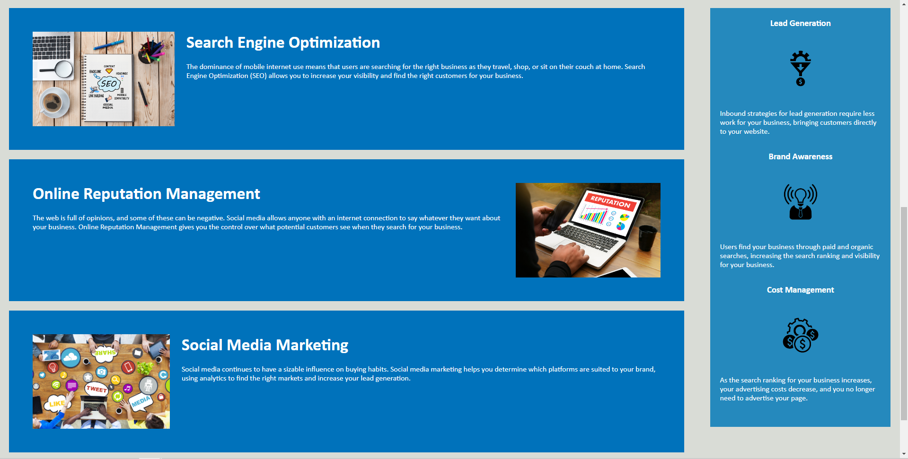

# <Horiseon Web Page>

## Description

- I started this project in order to refactor the Horisean web page for accessibility. 
- Changes I made to the project make the code easier to read.
- Working on this project taught me best practices for HTML and CSS.

## Installation

N/A

## Usage

This webpage serves as the main page for Horiseon Social Solution Services, Inc. It informs people what services Horiseon offers.
    

https://derekm129.github.io/horiseon-refactor/
    
## Credits

N/A

## License

Please refer to the license in the repo.
